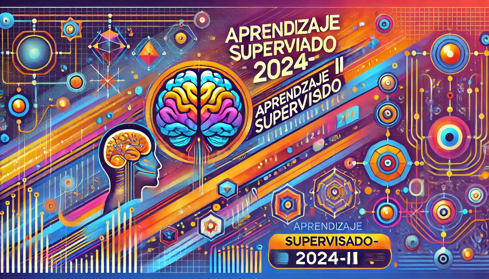

# Aprendizaje Supervisado - 2024-II

## Facultad de Ingeniería Estadística e Informática  
**Escuela Profesional de Ingeniería Estadística e Informática**

### Curso: Aprendizaje Supervisado (EST320)  
**Prerrequisito**: EST314 - Aprendizaje No Supervisado  
**Semestre Académico**: 2024-II  
**Docentes**: 
- Edgar Eloy Carpio Vargas

---

## Descripción del Curso

El curso de **Aprendizaje Supervisado** se enfoca en el desarrollo y análisis de modelos estadísticos mediante técnicas de machine learning, con un enfoque en la construcción y evaluación de modelos predictivos. Es un curso teórico-práctico que proporciona las herramientas necesarias para implementar modelos de regresión y clasificación, fundamentales en la toma de decisiones bajo condiciones de incertidumbre.

---

## Contenido del Curso

### **Unidad 1: Modelos de Regresión**
- **Objetivo**: Construir modelos de regresión utilizando técnicas de machine learning.
- **Temas**:
  - **Semana 1**: Revisión de técnicas no supervisadas (factorial, cluster y otros), y limpieza de datos.
  - **Semana 2**: Regresión lineal simple y múltiple.
  - **Semana 3**: Mejora de procedimientos en regresión lineal.
  - **Semana 4**: Árboles de regresión: evaluación y predicción.
  - **Semana 5**: Mejora de procedimientos en árboles de regresión.
  - **Semana 6**: Máquinas de soporte de vectores (SVM): evaluación y predicción.
  - **Semana 7**: Mejora de procedimientos en SVM.
  - **Semana 8**: Introducción a redes neuronales.
  - **Semana 9**: Retroalimentación y evaluación de modelos de regresión.

### **Unidad 2: Modelos de Clasificación**
- **Objetivo**: Aplicar técnicas de machine learning para la clasificación.
- **Temas**:
  - **Semana 10**: Análisis discriminante lineal y cuadrático.
  - **Semana 11**: Mejora de procedimientos en análisis discriminante.
  - **Semana 12**: Regresión logística simple y múltiple.
  - **Semana 13**: Mejora de procedimientos en regresión logística.
  - **Semana 14**: Árboles de clasificación.
  - **Semana 15**: Mejora de procedimientos en árboles de clasificación.
  - **Semana 16**: Máquinas de soporte de vectores (SVM) para clasificación.
  - **Semana 17**: Mejora de procedimientos en SVM para clasificación.
  - **Semana 18**: Evaluación final y retroalimentación (incluye Boosting y Bagging).

---

## Metodología

El curso se llevará a cabo a través de una combinación de clases teóricas, estudios de casos prácticos, y sesiones de retroalimentación. Los estudiantes trabajarán en ejemplos prácticos y casos de estudio que les permitirán aplicar las técnicas aprendidas a problemas reales.

### **Estrategias de Enseñanza**
- **Ejemplificación**: Uso de ejemplos durante las sesiones y actividades específicas.
- **Enseñanza Virtual**: Aulas virtuales y recursos en línea.

### **Estrategias de Aprendizaje**
- **Análisis Crítico**: Reflexión y análisis de casos de estudio, promoviendo el espíritu de investigación.

---

## Evaluación

### **Criterios de Evaluación**
La evaluación del curso se basa en dos unidades, cada una contribuyendo al 50% del promedio final del curso:

- **Unidad 1**: Construcción y análisis de modelos de regresión.
- **Unidad 2**: Desarrollo de modelos de clasificación.

### **Instrumentos de Evaluación**
- Reportes de hallazgos de casos de estudio
- Portafolios documentados
- Retroalimentación continua

---

## Fuentes de Información

- **Martínez Arias, R.** (2000). *El Análisis Multivariante en la Investigación Científica*. Edit. La Muralla.
- **Karthik, R. & Abhishek, S.** (2017). *Machine Learning Using R*. Edit. APRES.
- [Aprendizaje supervisado en R](https://fervilber.github.io/Aprendizaje-supervisado-en-R/index.html)
- [Data Science con R](https://bookdown.org/dparedesi/data-science-con-r/aprendizaje-supervisado.html)

---

## Proyecto Final y Portafolio

El curso culminará con la presentación de un portafolio que refleje el trabajo realizado a lo largo del semestre, incluyendo casos de estudio resueltos, informes de modelos construidos, y reflexiones sobre el proceso de aprendizaje.

---

### ¡Bienvenidos!

Este repositorio servirá como un espacio para documentar todos los trabajos, apuntes y proyectos realizados durante el curso. Se recomienda mantener una estructura organizada de carpetas y archivos para facilitar la revisión y evaluación.

---

